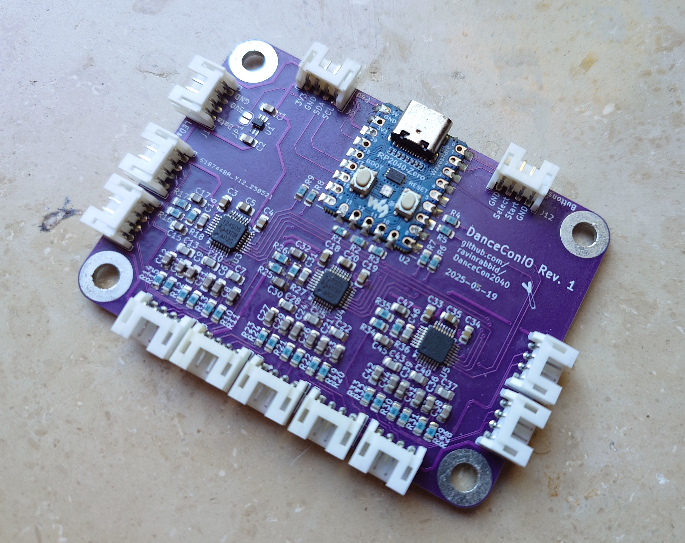

# DanceConIO - A 9-Channel High-Speed Body Scale for the DanceCon2040

This board hosts a Waveshare RP2040-Zero microcontroller unit and provides up to 9 differential inputs for sensors in Wheatstone Bridge configuration. In addition it provides signal shitting for WS2812 style LEDs and break out connectors for I2C and GPIOs.

## Sensors

Any sensor in Wheatstone bridge configuration should work.
Tests were mainly done using a configuration of four 50kg half bridge load cells, cf. [LoadCellAdapter](../LoadCellAdapter) for wiring.
Other sensors might need adjustment of the ADC's amplifier gain within the firmware.

## Notes

- Populate either 2 or 3 of the ADC sections:
  - 4-Panel Pads need 2 ADCs.
  - 5- and 6-Panel Pads can use 2 or 3 ADCs, using 3 will increase the sample rate.
  - 8- and 9-Panel Pads need 3 ADCs.
- Populated ADCs must be configured in firmware, otherwise they will interfere with the SPI bus and prevent the other ADCs from working properly.

## Bill of Materials

| **Reference**                                                                                                       |                **Description**                |      **Digikey Part**       |                                **Notes**                                 |
| ------------------------------------------------------------------------------------------------------------------- | :-------------------------------------------: | :-------------------------: | :----------------------------------------------------------------------: |
| U1                                                                                                                  | 74LVC1T45 Dual supply translating transceiver |       1727-4560-1-ND        | Can be omitted if you don't need level shifting, bridge JP1 in this case |
| U2                                                                                                                  |             Waveshare RP2040-Zero             |              -              |                                                                          |
| U3, U4, U5                                                                                                          |        ADS124S06 24bit Delta-Sigma ADC        |       296-45169-1-ND        |                                                                          |
| C1, C2, C4, C19, C34                                                                                                |          0.1µF SMD Ceramic Capacitor          |       1276-1003-1-ND        |                                                                          |
| C3, C18, C33                                                                                                        |          330nF SMD Ceramic Capacitor          |       1276-1123-1-ND        |                                                                          |
| C5, C20, C35                                                                                                        |           1µF SMD Ceramic Capacitor           |       1276-1029-1-ND        |                                                                          |
| C6, C8, C9, C11, C12, C14, C15, C17, C21, C23, C24, C26, C27, C29, C30, C32, C36, C38, C39, C41, C42, C44, C45, C47 |      2.2nF C0G/NP0 SMD Ceramic Capacitor      |       1276-2993-1-ND        |                                                                          |
| C7, C10, C13, C16, C22, C25, C28, C31, C37, C40, C43, C46                                                           |      22nF C0G/NP0 SMD Ceramic Capacitor       | 490-GRM2165C1H223JA01DCT-ND |                                                                          |
| R1-R9                                                                                                               |               47Ω SMD Resistor                |  2019-RK73H2ATTD47R0FCT-ND  |                                                                          |
| R10-R17, R19-R26, R28-R35                                                                                           |               150Ω SMD Resistor               |  2019-RK73H2ATTD1500FCT-ND  |                                                                          |
| R18, R27, R36                                                                                                       |              100kΩ SMD Resistor               |  2019-RK73H2ATTD1003FCT-ND  |                                                                          |
| J1-J12                                                                                                              |           4Pin S5B-PH-K-S Connector           |         455-1721-ND         |               PHR-4 plus SPH-002T-P0.5L is the counterpart               |
